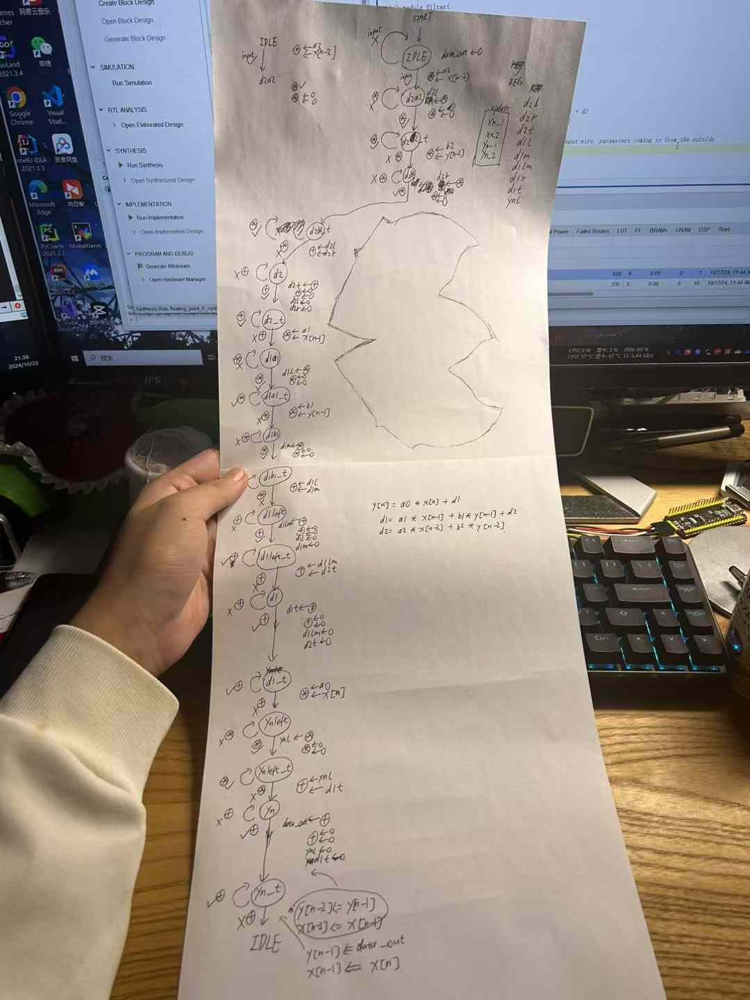
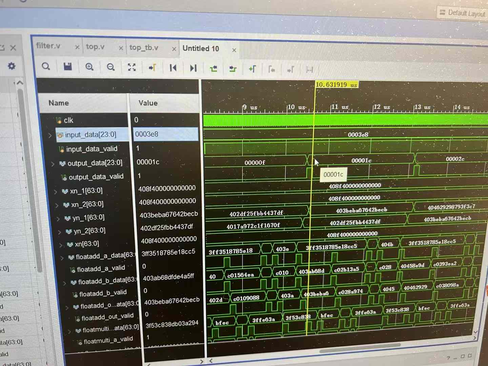
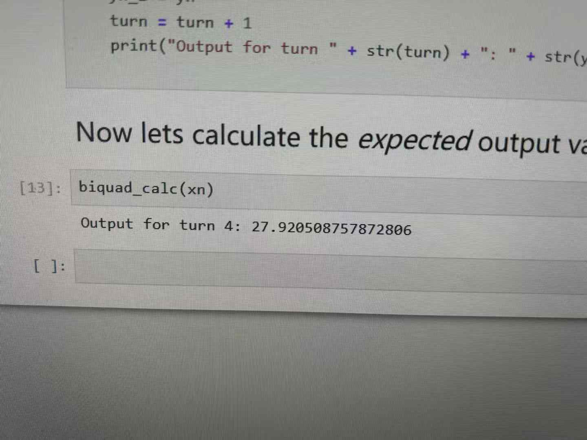
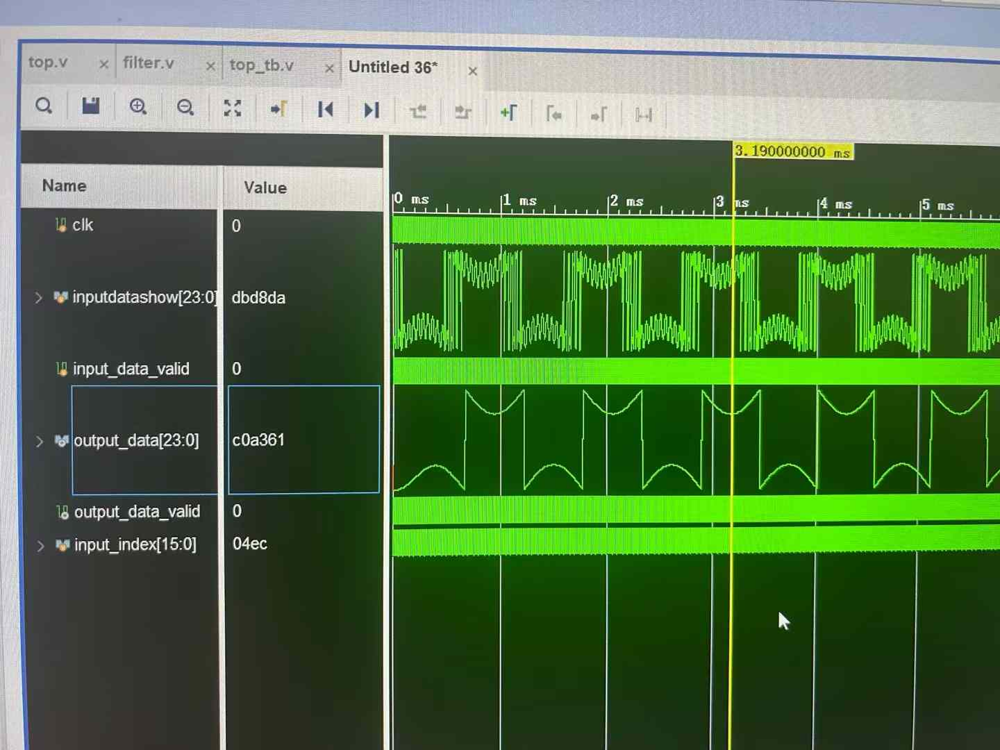
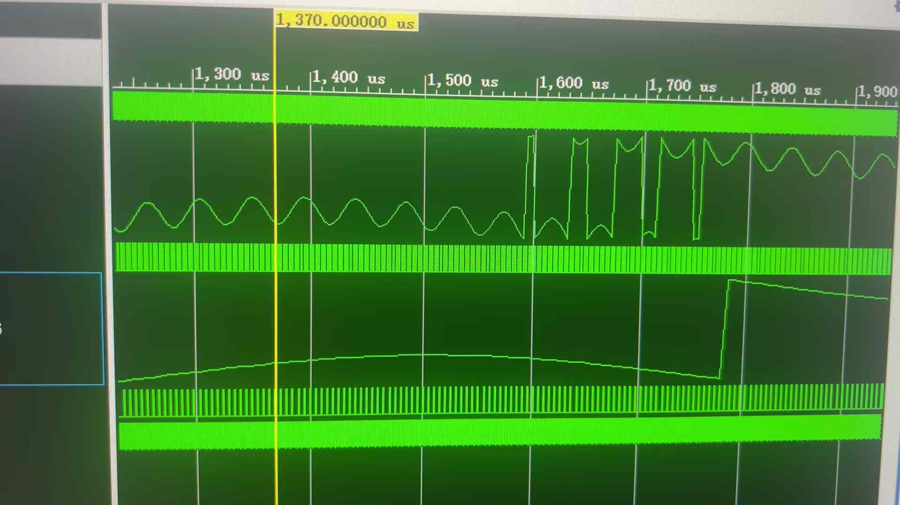

# Biquad-Filter-Verilog
A double precision biquad filter (IIR) designed in Verilog HDL. 
1 floating point multiplication and 1 floating point adder IP cores are used for biquad equation calculation 
Simulation scripts are included. To help you making editions and doing simulations, all signals and registers involved in biquad calculation steps are defined as output of the module, so you can easily check what's going on inside the state machine.
## How to use
To use this filter directly or making editions, just open `iir_design_waveSim.xpr` in Vivado. 
`biquadDesignHelper.ipynb` is a notebook written in Python which can help you check whether the filter module can output the correct value as we expected
## State transfer graph (draft)

## Simulation screenshots

